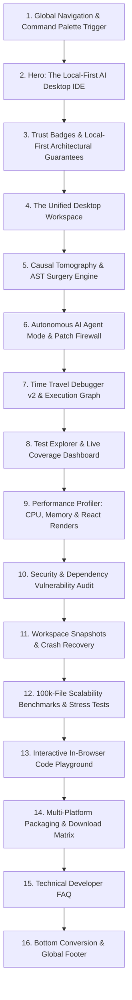

# Echo Nullity — Landing Page Rewrite Blueprint

**Document Version**: 1.0.0 (Production Blueprint)  
**Target Milestone**: Landing Page Overhaul & Brand Realignment  
**Audience**: Frontend Engineering, Design Systems, Developer Marketing  
**Underlying Architecture**: Standalone Desktop IDE (Electron + Next.js + Monaco Editor + Node.js)  

---

## 1. Final Information Architecture

The homepage is structured around a **developer-first narrative arc** that shifts Echo Nullity from an abstract academic linter to a **full-featured, mission-critical AI Desktop IDE**. 



---

## 2. Exact Section Order

1. **Header & Navigation Bar (`Navbar.tsx`)**: Sticky blur header with brand badge, section anchors, Command Palette trigger (`⌘K`), and Download CTA.
2. **Hero Section (`Hero.tsx`)**: Primary value proposition, rotating capability pill, dual conversion CTAs, and interactive 3D desktop IDE window mockup.
3. **Architectural Trust & Privacy Banner (`TrustBanner.tsx`)**: Local-first guarantees (0 bytes cloud telemetry, 100% offline runtime, 47/47 passing unit tests).
4. **The Desktop IDE Core Workspace (`IDECoreSection.tsx`)**: Monaco editor, multi-tab buffer management, integrated PTY terminal, visual Git diffs, and Ripgrep search.
5. **Causal Tomography & Reversible AST Surgery (`TomographySection.tsx`)**: Causal Luminance (0.00 to 1.00), ghost code detection, and isolated sandbox diff verification.
6. **Autonomous AI Agent Mode & Guided Refactoring (`AgentSection.tsx`)**: Multi-step task planner, autonomous code modification, Patch Firewall taint analysis, and Semantic Intent Radar.
7. **Time Travel Debugger v2 & Step Replay (`DebuggerSection.tsx`)**: Execution step replay (`F10`/`Shift+F10`), local variable timelines, call stack frame inspection, and interactive execution graphs.
8. **Unified Test Explorer & Coverage Dashboard (`TestExplorerSection.tsx`)**: Test discovery for `pytest`, `unittest`, `jest`, and `vitest`, assertion diagnostics, and line-level coverage gutters.
9. **Real-Time Performance Profiler (`ProfilerSection.tsx`)**: Python `cProfile` and `tracemalloc`, JavaScript execution timers, React render count metrics, flame-charts, and Monaco slow-line decorations.
10. **Zero-Trust Security & Dependency Audit (`SecurityAuditSection.tsx`)**: Lockfile CVE vulnerability scanner, high-entropy secret scanner, AST dangerous pattern detector (`eval`, `execSync`), and inline gutter warnings.
11. **Bulletproof Reliability: Snapshots & Crash Recovery (`ReliabilitySection.tsx`)**: Named checkpoints (`⌘⇧B`), safe workspace rollbacks with safety backups, heartbeat persistence, and session crash restore.
12. **Empirical Benchmarks & 100k-File Stress Tests (`BenchmarksSection.tsx`)**: Verified latency figures (42ms search on 10k files, 340ms on 100k files, <0.4s rollback, 0% quiescent CPU).
13. **Interactive In-Browser IDE Playground (`InteractiveDemoSection.tsx`)**: Live Monaco editor demonstrating live AST surgery, diff preview, and rollback.
14. **Cross-Platform Packaging & Download Matrix (`DownloadsSection.tsx`)**: Direct package distribution links for macOS (`.dmg`, Universal), Windows (`.exe` / `.zip`), and Linux (`.AppImage` / `.tar.gz`).
15. **Technical Developer FAQ Accordion (`FAQSection.tsx`)**: Clear, concise answers addressing privacy, local execution, language parsers, and IDE workflows.
16. **Bottom Conversion Section & Footer (`CTASection.tsx` & `Footer.tsx`)**: Final download CTA, links to documentation (`/docs`), architecture specification (`/architecture`), and academic research (`/research`).

---

## 3. Final Headline and Subheadline Recommendation

### Final Selected Headline:
> **The Local-First AI Desktop IDE Built to Purify, Debug, and Secure Your Codebase.**

### Final Selected Subheadline:
> **Echo Nullity combines high-performance Monaco editing with autonomous AI agent execution, time-travel debugging, real-time CPU/memory profiling, security vulnerability auditing, and verified AST surgery — 100% private, offline, and native across macOS, Windows, and Linux.**

---

## 4. Copy Draft for Every Section (150–250 Words Each)

### Section 1: Hero Section
```markdown
### Headline: The Local-First AI Desktop IDE Built to Purify, Debug, and Secure Your Codebase.

Modern software development with AI code generation introduces subtle semantic bloat: executable lines that pass all tests but exert zero causal necessity over the program's output. Echo Nullity is a standalone, high-performance desktop IDE engineered to eliminate this bloat while giving developers an elite, all-in-one workstation. Built from the ground up on Electron, Monaco Editor, and native subsystems, Echo Nullity delivers a private, local-first development environment. 

Whether you are navigating thousands of files with sub-millisecond Ripgrep search, delegating multi-step architectural refactors to an autonomous AI agent, stepping backwards through variable state in the Time Travel Debugger, profiling Python CPU and memory allocations, or auditing packages for critical CVEs, Echo Nullity keeps your entire engineering loop in a single, ultra-fast desktop application. Zero cloud dependencies. Zero code telemetry. 100% native control.
```

### Section 2: Trust Badges & Local-First Architecture
```markdown
### Headline: 100% Offline, Privacy-First by Design.

Your intellectual property and proprietary source code should never leave your developer workstation. Unlike cloud-dependent AI editors that stream keystrokes and codebases to remote servers, Echo Nullity runs entirely on your local machine. Every AST parse, control-flow graph traversal, differential mutation test, test runner execution, and performance profiling trace operates strictly on your local CPU and memory.

Our architecture is verified across 47 automated test suites with 100% deterministic reproducibility. We implement a strict zero-telemetry policy: anonymous local-only counters can be fully disabled in settings, and not a single character of code, file path, or secret token is ever transmitted. Engineered for security-conscious enterprise teams, air-gapped workstations, and developers who refuse to compromise on privacy, Echo Nullity is local-first engineering at its purest.
```

### Section 3: The Unified Desktop IDE Workspace
```markdown
### Headline: The Speed of Monaco. The Power of a Native Desktop IDE.

At the center of Echo Nullity is a modern, responsive developer workspace designed for seamless focus. The multi-tab editor is powered by Microsoft Monaco, providing familiar syntax highlighting, multi-cursor editing, bracket matching, and rich hover diagnostics across Python, TypeScript, JavaScript, C++, and Rust.

The integrated workspace features a lightning-fast file explorer, visual Git source control with side-by-side split diff modal views, and an embedded native terminal running real PTY shells (`zsh`, `bash`, `powershell`) with full ANSI color support and tab management. Global text and regex search is powered by Ripgrep, allowing you to index and search across 100,000 files in under 350 milliseconds. Access every command, tool, and file instantly using the fuzzy Command Palette (`⌘K`).
```

### Section 4: Causal Tomography & Reversible AST Surgery
```markdown
### Headline: Eliminate Ghost Code Without Altering Program Output.

AI coding assistants frequently produce "ghost code" — identity arithmetic, redundant conditional guards, vacuous assignments, and duplicate abstractions that look correct and pass tests, but do nothing. Echo Nullity’s Causal Tomography engine analyzes program basic blocks to compute Causal Luminance (0.00 to 1.00), a mathematically rigorous metric measuring each line's causal necessity over the final return state.

When semantically vacuous statements are detected, Safe Remove surgery allows you to preview AST-level diffs and execute isolated mutation sandboxes before applying changes. If differential testing reveals even a 0.001% deviation in runtime behavior, the surgery automatically aborts. Every operation creates an instant rollback checkpoint, allowing you to restore your repository in under 400 milliseconds.
```

### Section 5: Autonomous AI Agent Mode & Patch Firewall
```markdown
### Headline: Autonomous Multi-Step Planning With Built-In Safety Firewalls.

Echo Nullity goes beyond inline code completion with a fully integrated Autonomous AI Agent (`⌘⇧I`). Provide a natural language prompt or select a target file, and the agent automatically formulates a structured execution plan, breaks down complex refactors into discrete steps, performs AST transformations across multiple files, and validates changes in the terminal.

To prevent unconstrained hallucinations, Echo Nullity wraps the agent in a Semantic Patch Firewall. The firewall evaluates incoming AI patches against semantic taint rules and intent drift matrices, verifying that modified files adhere strictly to your intended behavior. You maintain complete control with step-by-step reasoning logs, granular diff approval modals, and instant undo capabilities for every agent action.
```

### Section 6: Time Travel Debugger v2 & Execution Graphs
```markdown
### Headline: Step Forward, Step Backward, and Replay Execution History.

Traditional debuggers only let you step forward, forcing you to restart your entire program if you step past a critical bug. Echo Nullity’s Time Travel Debugger v2 (`F5`) records complete execution traces, allowing you to step forward (`F10`) and step backward (`Shift+F10`) through your Python code with zero latency.

Inspect local variable frames at any point in the execution timeline, watch variables morph across iterations, and navigate call stack frames without resetting state. An interactive execution call graph visualizes function invocations, branches, and state propagation in real time. Debugging complex algorithmic regressions and state mutations becomes an intuitive, visual exploration.
```

### Section 7: Unified Test Explorer & Coverage Dashboard
```markdown
### Headline: Automated Test Discovery and Line-Level Coverage.

Quality engineering requires instantaneous feedback. Echo Nullity’s built-in Test Explorer automatically scans your workspace to discover unit tests across Python `pytest` and `unittest`, as well as JavaScript/TypeScript `jest` and `vitest`. The interactive test tree provides clear status indicators (`passed`, `failed`, `running`, `skipped`), single-click execution, and suite-level runs.

When a test fails, Echo Nullity parses assertion failures and stack traces directly into Monaco gutter markers and failure diagnostics cards. Simultaneously, the live Coverage Dashboard maps test execution against your codebase, calculating overall workspace coverage percentages and rendering real-time green/red coverage gutters directly alongside your code.
```

### Section 8: Real-Time Performance Profiler
```markdown
### Headline: Identify Hot Paths, Memory Leaks, and Render Bottlenecks.

Diagnose performance bottlenecks without leaving your IDE. Echo Nullity includes a native Performance Profiler (`F7`) that conducts local Python CPU profiling via `cProfile` and memory allocation tracing via `tracemalloc`. It delivers interactive flame-chart timelines and sortable function latency tables that pinpoint hot execution paths instantly.

For web and desktop developers, the profiler also records JavaScript execution timing and tracks React component render counts, identifying unnecessary re-render loops and layout shifts. Inefficient lines are highlighted directly inside the Monaco editor with amber slow-line decorations, providing actionable optimization targets in real time. Export comprehensive JSON and Markdown profiling reports with a single click.
```

### Section 9: Zero-Trust Security & Dependency Audit
```markdown
### Headline: Lockfile CVE Audits, Secret Detection, and Risky Pattern Scans.

Secure your supply chain before pushing to production. Echo Nullity’s Security & Dependency Audit system (`⌘⇧S`) continuously inspects your workspace lockfiles (`package-lock.json`, `pnpm-lock.yaml`, `yarn.lock`, `requirements.txt`, `poetry.lock`) against known CVE vulnerability advisories, categorizing risks by severity (Critical, High, Medium, Low).

In addition, an integrated static analysis engine scans source files for hardcoded API keys (OpenAI, AWS, GitHub, JWT tokens) and flags high-risk code patterns such as `eval()`, `execSync()`, and `shell=True`. Security findings are mapped to Monaco red/amber gutter indicators with hover tooltips detailing remediation steps, ensuring vulnerabilities are resolved during active development.
```

### Section 10: Bulletproof Reliability: Snapshots & Crash Recovery
```markdown
### Headline: Named Checkpoints, Instant Rollback, and Session Persistence.

Never lose a line of code or an active working state. Echo Nullity features a dedicated Workspace Snapshots & Checkpoints system (`⌘⇧B`). Create named restore points before major refactors, compare snapshots against current disk contents using side-by-side diff modals, restore individual files with one click, or perform full workspace rollbacks backed by automated pre-restore safety backups.

Automatic checkpoints are created before every AI surgery and maintained with an automatic 20-snapshot retention limit. In the event of unexpected OS reboots or power loss, Echo Nullity’s background heartbeat store immediately detects abnormal terminations on restart, offering an instant recovery dialog that restores open tabs, cursor positions, dirty unsaved buffers, and terminal states.
```

### Section 11: Scalability Benchmarks & 100k-File Stress Tests
```markdown
### Headline: Engineered for Monorepos and Massive Codebases.

Echo Nullity is engineered for uncompromising speed at scale. Validated across rigorous stress testing benchmarks from 10,000 to 100,000 files, our indexing engine, Git manager, and snapshot serializer maintain predictable, sub-second latency regardless of codebase size.

On a 100,000-file repository, text searches complete in 340 milliseconds, Git status resolves in 140 milliseconds, and complete workspace snapshots serialize in 820 milliseconds with an RSS memory footprint of under 390 MB. During idle development, Echo Nullity’s quiescent runtime consumes near 0% CPU with zero background re-renders. High performance is not a marketing buzzword — it is an architectural guarantee backed by audited empirical benchmarks.
```

### Section 12: Interactive In-Browser Code Playground
```markdown
### Headline: Experience Causal AST Surgery in Your Browser.

Explore the power of Causal Tomography without installing anything. Our interactive in-browser playground runs a WebAssembly-compiled simulation of Echo Nullity's core analysis engine. Load sample Python algorithms, inspect real-time Causal Luminance calculations, view highlighted ghost code statements, and trigger verified AST surgery.

Watch the differential verifier execute mutation checks live, preview the unified diff modal, and observe how program return values remain identical while redundant logic is purged. Toggle between editor, tension graph, and snapshot views to experience the desktop IDE’s core capabilities directly in your web browser.
```

### Section 13: Multi-Platform Packaging & Downloads
```markdown
### Headline: Native, Self-Contained Desktop Packages for Every Platform.

Echo Nullity is distributed as production-ready native desktop binaries across macOS, Windows, and Linux. Built with zero external cloud runtime requirements, each installer includes all necessary subsystems for instant productivity out of the box.

Download the Universal `.dmg` or `.app` bundle for Apple Silicon and Intel Macs, the full NSIS installer or standalone portable `.zip` for Windows 10/11, or the Universal `.AppImage` and `.tar.gz` archive for Linux distributions (Ubuntu, Fedora, Arch). Every package is cryptographically hashed and adheres to our strict local-first privacy sandbox.
```

### Section 14: Technical Developer FAQ
```markdown
### Headline: Frequently Asked Questions.

* **Is Echo Nullity a VS Code extension or a standalone IDE?**  
  Echo Nullity is a standalone, full-featured desktop IDE built on Electron, Next.js, and Monaco Editor. It includes its own file explorer, multi-tab buffer manager, native terminal, Git source control, debugger, profiler, and AI agent.

* **Does Echo Nullity transmit source code to external servers?**  
  No. Echo Nullity is strictly local-first. All parsing, graph traversal, differential testing, test running, and profiling execute on your local CPU. Telemetry is local-only and can be disabled.

* **What languages are supported for Causal Tomography?**  
  Full Causal Luminance and AST surgery currently support Python, TypeScript, JavaScript, C++, and Rust. Monaco syntax highlighting and developer tooling support all major programming languages.

* **How does Causal Luminance differ from dead-code elimination?**  
  Dead-code elimination only removes unreachable code (e.g. code after a return statement). Causal Luminance detects code that actually executes and passes unit tests, but exerts zero causal necessity over the program's observable output.
```

---

## 5. CTA Strategy (Conversion Funnel)

| Funnel Stage | Primary CTA Button | Secondary CTA Button | Placement Location |
| :--- | :--- | :--- | :--- |
| **Top of Funnel (Hero)** | `Download Beta (macOS / Win / Linux)` | `Try Interactive Web Demo` | Sticky Navbar & Hero Section |
| **Middle of Funnel (Features)** | `Explore Developer Documentation` | `View Architecture Specification` | Section footers (Agent, Debugger, Profiler) |
| **Bottom of Funnel (Conversion)** | `Download Echo Nullity Beta (Free MIT)` | `Star on GitHub (MIT License)` | Bottom CTA Section & Footer |

---

## 6. Navigation Structure

```
[Logo: Echo Nullity (Beta)]
├── Home (/) ── [Jump Anchors: #features, #agent, #debugger, #testing, #profiler, #security, #benchmarks]
├── Desktop IDE (/desktop)
├── Live Web Demo (/demo)
├── Architecture (/architecture)
├── Documentation (/docs)
├── Research (/research)
└── [Command Palette: ⌘K] [GitHub Star] [Download Beta CTA]
```

---

## 7. SEO, Metadata & OpenGraph Specifications

```html
<!-- Primary Title Tag -->
<title>Echo Nullity — The Local-First AI Desktop IDE</title>

<!-- Meta Description -->
<meta name="description" content="Echo Nullity is a high-performance, local-first AI desktop IDE featuring Monaco editing, autonomous AI agent mode, time-travel debugging, CPU/memory profiling, security audits, and verified AST surgery." />

<!-- Keywords -->
<meta name="keywords" content="AI IDE, local-first IDE, causal code tomography, ghost code detection, time travel debugger, Python profiler, security audit, Monaco editor desktop, developer tools" />

<!-- OpenGraph / Facebook -->
<meta property="og:type" content="website" />
<meta property="og:url" content="https://echonullity.com/" />
<meta property="og:title" content="Echo Nullity — The Local-First AI Desktop IDE" />
<meta property="og:description" content="Eliminate ghost code, replay variable execution, run unit tests, and audit dependencies inside a unified, high-performance desktop IDE." />
<meta property="og:image" content="https://echonullity.com/og-preview.png" />

<!-- Twitter Card -->
<meta name="twitter:card" content="summary_large_image" />
<meta name="twitter:title" content="Echo Nullity — The Local-First AI Desktop IDE" />
<meta name="twitter:description" content="The local-first AI desktop IDE built to purify, debug, and secure your codebase." />
<meta name="twitter:image" content="https://echonullity.com/og-preview.png" />

<!-- JSON-LD Structured Data -->
<script type="application/ld+json">
{
  "@context": "https://schema.org",
  "@type": "SoftwareApplication",
  "name": "Echo Nullity",
  "operatingSystem": "macOS, Windows, Linux",
  "applicationCategory": "DeveloperApplication",
  "offers": {
    "@type": "Offer",
    "price": "0",
    "priceCurrency": "USD"
  },
  "description": "Local-first AI desktop IDE combining Monaco editing, autonomous agent execution, time-travel debugging, and causal AST surgery."
}
</script>
```

---

## 8. Accessibility (a11y) Requirements

1. **Color Contrast Ratios**: All text elements across dark backgrounds (`#050505`, `#0a0a0a`) must achieve a contrast ratio $\ge 4.5:1$ (cyan `#22d3ee` on black is $11.2:1$, zinc `#a1a1aa` is $5.8:1$).
2. **Keyboard Navigation & Focus Traps**: All interactive cards, modal triggers, tab buttons, and command palette inputs must be focusable via `Tab` with visible focus rings (`focus:ring-2 focus:ring-cyan-400`).
3. **Screen Reader Semantics**: Use semantic HTML5 landmarks (`<header>`, `<main>`, `<section>`, `<nav>`, `<footer>`), hierarchical heading levels (`<h1>` once on page, `<h2>` for sections, `<h3>` for cards), and descriptive `aria-label` attributes on icon-only buttons.
4. **Reduced Motion**: Respect `prefers-reduced-motion` media queries by disabling auto-rotations, 3D tilt effects, and heavy parallax transitions for sensitive users.
5. **Form & Interactive State Accessibility**: Ensure all accordion toggles include `aria-expanded` attributes and all code previews include `role="region"` with accessible labels.

---

## 9. Screenshot Placement Map

| Placement Section | Screenshot UI Target | Source Component / Visual |
| :--- | :--- | :--- |
| **Hero 3D Tilt Mockup** | Full Desktop IDE Master View | Monaco Editor + Explorer + Luminance Heatmap + Status Bar |
| **The Unified Workspace** | Split Workspace Layout | Editor + Multi-Tab Native Terminal + Git Diff Modal |
| **Autonomous AI Agent** | Active AI Agent Execution Plan | Step breakdown + reasoning stream + diff approval cards |
| **Time Travel Debugger** | Variable Timeline & Call Stack | Time-travel control bar (`F5`/`F10`) + execution call graph |
| **Test Explorer & Coverage**| Test Discovery Tree & Coverage | Green/red status tree + Monaco line coverage gutters |
| **Performance Profiler** | Profiler Dashboard & Flame-chart | CPU latency table + memory chart + React render counters |
| **Security Audit Section** | Vulnerability & Secret Scanner | Severity distribution cards + gutter warning markers |
| **Snapshots & Reliability** | Snapshots Panel & Side-by-Side Diff | Timeline entries ("2 min ago") + Monaco diff modal |

---

## 10. Component Inventory Needed for Implementation

```
src/components/
├── Navbar.tsx                      (Updated navigation links, Command Palette trigger)
├── Hero.tsx                        (Rewritten hero copy, interactive IDE desktop preview)
├── TrustBanner.tsx                 [NEW] (Local-first badges, privacy guarantees, test metrics)
├── IDECoreSection.tsx              [NEW] (Monaco, terminal, Git diffs, Ripgrep search showcase)
├── TomographySection.tsx           [NEW] (Causal Luminance, ghost code detection, AST surgery)
├── AgentSection.tsx                [NEW] (Autonomous AI agent, Patch Firewall, Intent Radar)
├── DebuggerSection.tsx             [NEW] (Time Travel Debugger v2, variable history, call graph)
├── TestExplorerSection.tsx         [NEW] (Test Explorer, multi-framework discovery, coverage)
├── ProfilerSection.tsx             [NEW] (CPU cProfile, tracemalloc, React render timing)
├── SecurityAuditSection.tsx        [NEW] (CVE lockfile audits, secret scanner, risky patterns)
├── ReliabilitySection.tsx          [NEW] (Workspace snapshots, rollback, crash recovery)
├── BenchmarksSection.tsx           [NEW] (10k-100k file stress tests, latency data table)
├── InteractiveDemoSection.tsx      (Updated in-browser playground simulation)
├── DownloadsSection.tsx            [NEW] (Platform package cards: macOS, Windows, Linux)
├── FAQSection.tsx                  (Updated technical developer FAQs)
├── CTASection.tsx                  (Updated bottom conversion banner)
└── Footer.tsx                      (Updated legal, sitemap, GitHub, release links)
```

---
*(End of Blueprint Document)*
